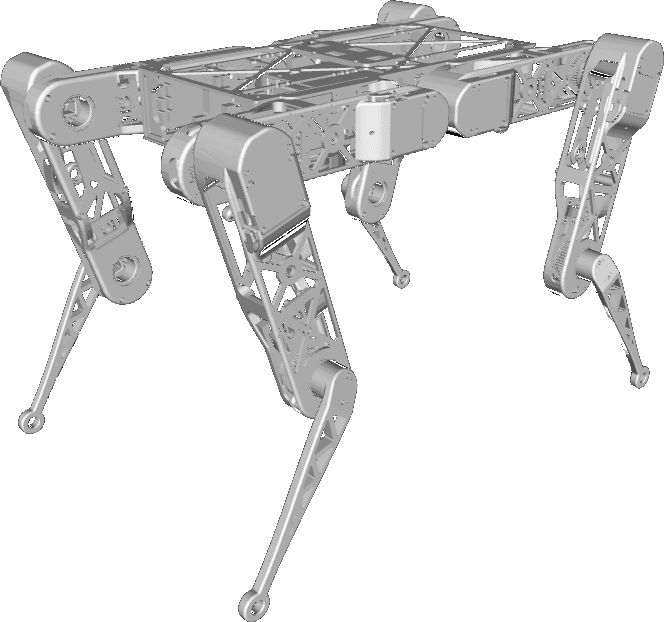

# Mulinex Robot Description (URDF)

## Overview
This package contains a simplified robot description (URDF) of the Mulinex robot.
The shanks collisions can be changed. You can use both real meshes or simplified ones.

The MulineX robot is a quadrupedal robot developed by the [University of Pisa](https://www.unipi.it/) and the [Research Center E. Piaggio](https://www.centropiaggio.unipi.it/).



## Usage
Compile and source the workspace with
```shell
colcon build --symlink-install && . install/setup.bash
```

To visualize and debug the robot description, start the standalone visualization (note that you have to provide the following additional dependencies: `joint_state_publisher`, `joint_state_publisher_gui`, `robot_state_publisher`, `rviz2`, `xacro`):
```shell
ros2 launch mulinex_description display_mulinex.launch.py
```